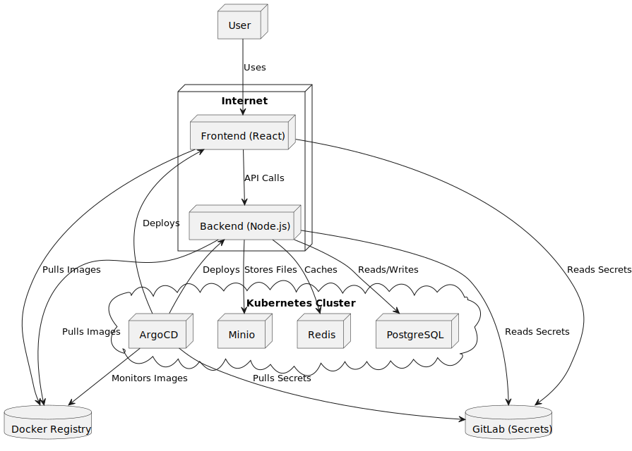
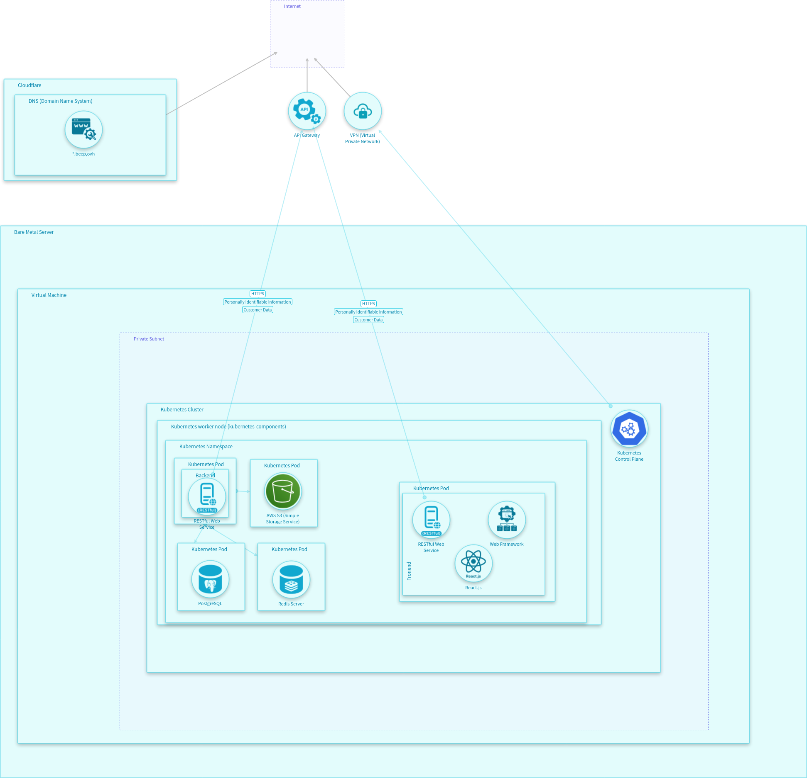

== Beep security report
PONTHIEU Hugo, TCHILINGUIRIAN Théo.

:toc:
:toclevels: 3
:toc-title: Table of Contents

=== What is Beep?

Beep is a discord-like web application that allows users to communicate in real-time through text, voice, and video.

Beep is a discord like application. It as a Node.js backend and a React frontend. All of the code is containerized using Docker. The images are built, then pushed inside a Docker registry.

Next, the application is deployed on a Kubernetes cluster. Each time the code is updated, a new image is built and pushed to the registry. In the same time an helm chart is updated with the new image tag. And an ArgoCD instance monitor this repo and redeploy the application when the tag changes. 

For state management, Beep uses:
- Redis
- PostgreSQL
- Minio

Those are deployed on the same Kubernetes cluster in the same network zone. This is deployed using IAC tools (Terraform). It deploys the services with open source helm charts. Then we use Helm terraform provider to deploy the helm charts with the right values.

The secrets are stored in gitlab and are encrypted with sealed secrets. The secrets are deploy in the same time that the services.

The frontend is accessible on Internet, as well as the backend, with no DMZ or firewalls in the way, except for Polytech's managed gateway.  
The backend consumes the Redis and PostgreSQL services. The frontend consumes the backend API.

==== Project deployment diagram

The following diagram illustrates the deployment architecture of Beep, including its components and their interactions:

=== Threats & security risk assessment

This report provides a comprehensive security risk assessment of the Beep platform, focusing on identifying potential vulnerabilities and threats to its components. The assessment includes an analysis of the backend API, frontend application, and infrastructure managed through Terraform.

Using automated tools, we have conducted Static Application Security Testing (SAST) and Software Composition Analysis (SCA) to identify vulnerabilities in the codebase and its dependencies, as well as container images. Additionally, we have performed threat modeling to assess potential risks and recommend mitigations.

Static Application Security Testing (SAST) is a method of analyzing source code to identify security vulnerabilities without executing the program. It helps developers find and fix issues early in the development process. Using Snyk to conduct SAST, we have found several vulnerabilities in the Beep platform's codebase, including issues related to authentication, access control, and data security.

Software Composition Analysis (SCA) is a process of identifying and managing open source components and their dependencies in software projects. It helps to analyze dependencies, but also to ensure that the software is secure and compliant with licensing requirements. Using Trivy, we have identified vulnerabilities in the Beep platform's container images, including outdated dependencies and known security issues, including published Common Vulnerabilities and Exposures (CVEs) and misconfigurations.

=== What we've done

Currently, Beep does not have security risk assessment mechanisms in place. To address this issue, we have conducted a security risk assessment of three repositories and container images of Beep:

- The backend API's repository and container image,
- The frontend's repository and container image,
- The Terraform IaC repository.

Each repository has a GitLab CI for building images (frontend and backend) or deploying infrastructure (Terraform IaC).

We have implemented Static Application Security Testing (SAST) and Software Composition Analysis (SCA) in the CI/CD pipelines of these repositories. This allows us to automatically scan for vulnerabilities in the code and its dependencies, as well as the build container images. This allows for security issues to be identified earlier, in the development process, before they reach production.

We have used IriusRisk, Snyk, and Trivy to perform the security risk assessment of the Beep platform.

Conducting this has allowed us to identify potential threat vectors and Common Vulnerabilities and Exposures (CVEs). The assessment was performed using various tools, including IriusRisk for threat modeling and risk assessment, Snyk for static code analysis, and trivy for container image scanning. Dependencies were also analyzed for known vulnerabilities.

=== Summary of findings

==== Threat modeling and security risk assessment with IriusRisk

We used IriusRisk to build a model of our infrastructure. IriusRisk then generated a threat model based on the given architecture of the Beep platform, including potential threats, vulnerabilities, and mitigations for each component of the system.

===== Methodology

Our assessment followed a four-step approach: Asset Identification of critical systems and data; Threat Modeling using IriusRisk templates for web applications; Risk Evaluation based on likelihood and impact; and Countermeasure Planning for significant threats.

===== Key Findings

The threat modeling identified several high-priority concerns including unauthorized administrative access, DNS vulnerabilities (spoofing and unencrypted traffic), insufficient logging and monitoring, access control weaknesses, and infrastructure security gaps in Kubernetes deployment.

===== Critical Threats

Our assessment revealed several critical security threats to the Beep platform:

*Authentication Issues*: Unauthorized administrative access poses significant risk of configuration changes and data breaches. Inadequate RBAC implementation allows users to potentially access unauthorized resources.

*Network Vulnerabilities*: DNS spoofing could redirect users to malicious websites, while unencrypted DNS traffic exposes user browsing patterns. Insecure Kubernetes PKI key file permissions could enable unauthorized system access.

*Operational Weaknesses*: Insufficient logging prevents detection of malicious activities. Lack of rate limiting exposes services to denial-of-service attacks, particularly affecting Redis Server performance.

*Data Security Concerns*: Insecure file permissions on PostgreSQL databases and inadequate protection of secrets management increase risk of data exposure.

===== Potential Mitigations

*Short-term Actions*: 
Our immediate recommendations focus on critical security controls. Implementing multi-factor authentication for administrative interfaces will significantly reduce unauthorized access risk. Applying proper file permissions (600) to Kubernetes PKI keys is essential to prevent unauthorized system access. Enabling comprehensive logging across all critical services will help detect suspicious activities. Encrypting DNS traffic using DoH or DoT protocols will protect against DNS-based attacks and eavesdropping.

*Medium-term Strategy*: 
For sustained security improvement, we recommend deploying Role-Based Access Control throughout the application stack to enforce the principle of least privilege. Implementing rate limiting and resource throttling will protect services from denial-of-service attacks. Establishing secure secrets management workflows will safeguard sensitive credentials. Setting up real-time monitoring and alerting systems will enable rapid response to security incidents.

*Long-term Approach*: 
To build a security-focused culture, we suggest developing comprehensive security training for all developers to ensure secure coding practices. Establishing automated security testing in the CI/CD pipeline will catch vulnerabilities early in development. Creating detailed incident response procedures for various threat scenarios will improve recovery time. Implementing regular security assessments and penetration testing will continuously identify and address new vulnerabilities.

The implementation of these mitigations, prioritizing the highest-risk items first, will substantially improve Beep's security posture and reduce vulnerability to attacks.

You can find more details about the threat model in the `countermeasures/` directory.

==== SAST on codebase with Snyk

We have updated Beep's GitLab CI test stages to include SAST scans using Snyk. This allows us to automatically scan the codebase for vulnerabilities.

//TODO: Add content here

You can find more details about the threat model in the `countermeasures/` directory.

==== SCA on container images with Trivy

We have updated Beep's GitLab CI test stages to include SCA scans using Trivy. This allows us to automatically scan container images for vulnerabilities during the build process.

//TODO: Add content here

You can find more details about the threat model in the `countermeasures/` directory.

---

À rendre à cchassagnard@slb.com
Amaury Viala: aviala@slb.com

